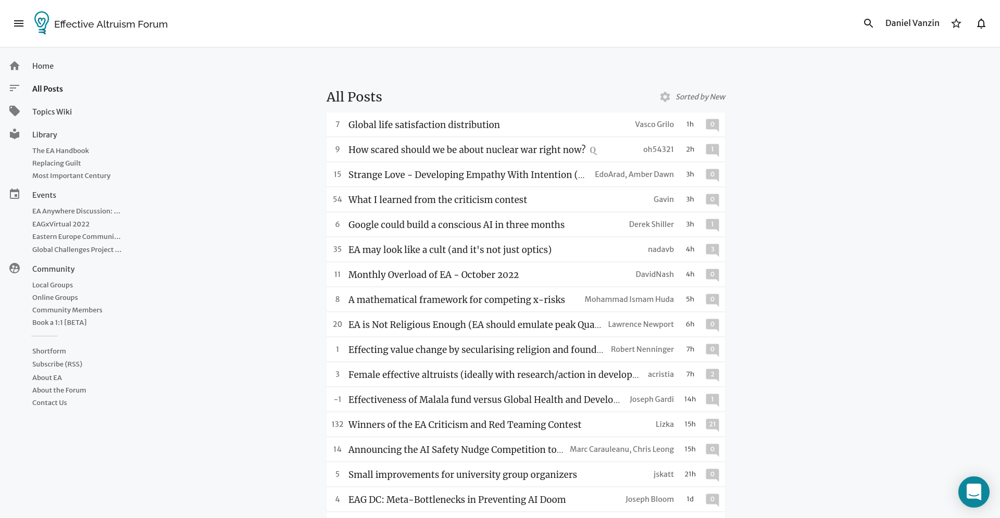
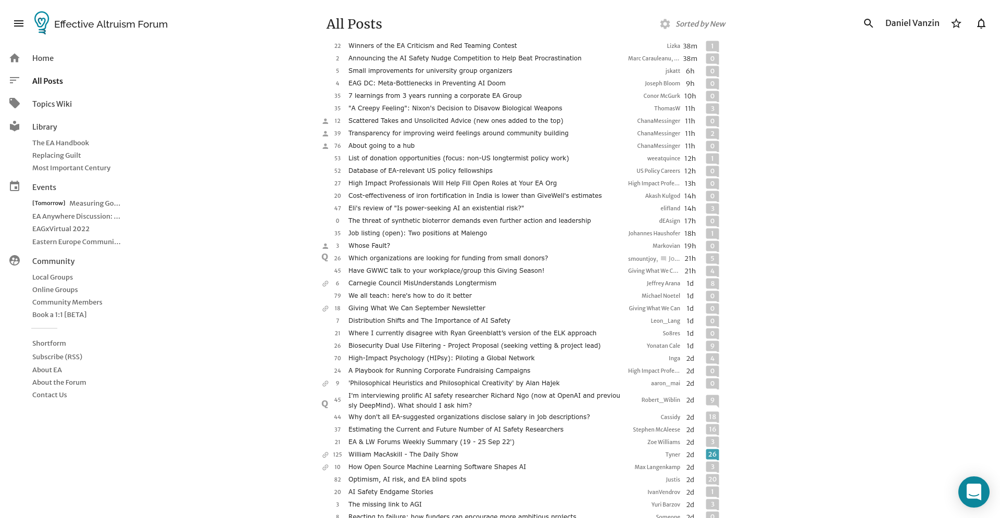
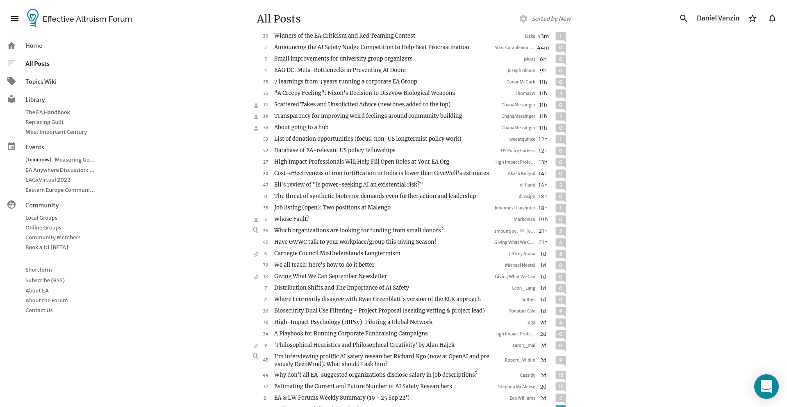

# Clearer EffectiveAltruism.org Forum
More familiar, clean and compact forum UX, with an improved topics organization.

## Before

## After

## After (original font)

## Install
[Userscript][1]

Incoming: Firefox, Chrome

## Why
The design of https://forum.effectivealtruism.org is very different from other popular online communities. This makes for an awkward first impression, users like familiarity in their UI.

- compact layout
- less clutter through hiding, repositioning, styling, collapsing
- no gray backgrounds with "gray"ish fonts
- no title trimming, breaking a line when needed
- easier topics navigation (TODO)
- less annoying popups (WIP)

<!-- This is a forum, yet there are no topics / subtopics. It tries to do too much in one place. I don't think questions, articles and events belong in in the same listing. I am aware of the filters, my criticism still stands :-)
Infinite scroll / load more adds uncertainty to the UX. It's hard to track context, I can't tell if I click somewhere all my "progress" will be lost.
The comments font looks bold, it should be lighter.
Some pages have too much info. "How to use the Forum" shouldn't have a pages long comments section, specially with unrelated discussions. -->

[1]: https://openuserjs.org/users/icetbr/scripts
